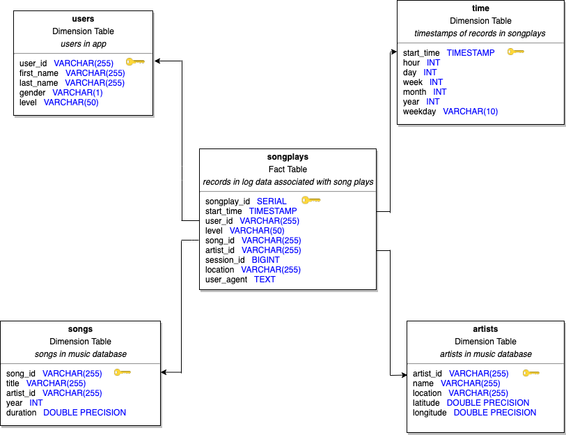

# Project: Data Modeling with Postgres

## Table of Contents

* [Purpose](#Schema-definition)
* [File Directory](#File-Directory)
* [Dataset] (#Dataset)
* [How to run](#How-to-run)
* [Database Schema](#Database-schema)
* [Example queries](#Example-queries)

## Purpose

Create a Postgres database with tables designed to optimize queries on song play analysis and build an ETL pipeline using Python for startup Sparkify.

## File Directory

Required files for running the program:

* create_tables.py - drops and creates tables.
* etl.py - reads and processes files from song_data and log_data and loads them into the tables. 
* sql_queries.py - contains SQL queries for creating and dropping tables and inserting values into the tables.

Jupyter notebooks for testing code:

* etl.ipynb - contains detailed instructions on the ETL process for each of the tables.
* test.ipynb - displays the first few rows of each table to check if the database looks correct.

## Dataset

Two datasets were used for this project (not included).

1. Song Dataset - subset of real data from the Million Song Dataset. Each file is in JSON format and contains metadata about a song and the artist of that song

2. Log Dataset - consists of log files in JSON format generated by an event simulator based on the songs in the dataset above. These simulate activity logs from a music streaming app based on specified configurations.

## How to Run

Before running this project, the following software and packages (with the versions used) must be installed:

* PostgreSQL 9.5.19
* Python 3.6.3
* pandas 0.23.3
* psycopg2 2.7.4

Download the python scripts and datasets. They should be arranged like so:

```
* create_tables.py
* etl.py
* sql_queries.py
* data/
  * log_data/
  * song_data/
  
```

Run the following commands in the terminal:

1. Create tables for Postgres database.
```
python create_tables.py
```

2. Execute ETL pipeline to process and insert JSON data to tables.
```
python etl.py
```

## Database Schema

Diagram of a star schema used for designing the Postgres database. 

The key symbol in each table represents the primary key.




## Example Queries

Query to determine the hours users are most active. 

```
SELECT count(start_time), DATE_PART('hour', start_time) FROM songplays GROUP BY DATE_PART('hour', start_time) ORDER BY count DESC;
```

Query to determine how many songs played fall under "free" or "paid". 
```
SELECT level, count(level) FROM songplays GROUP BY level ORDER BY count DESC;
```
